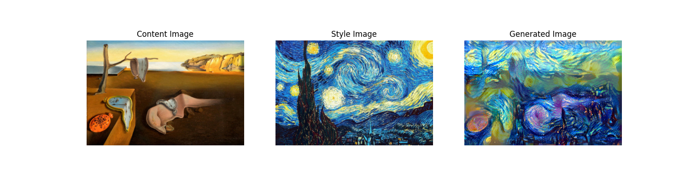
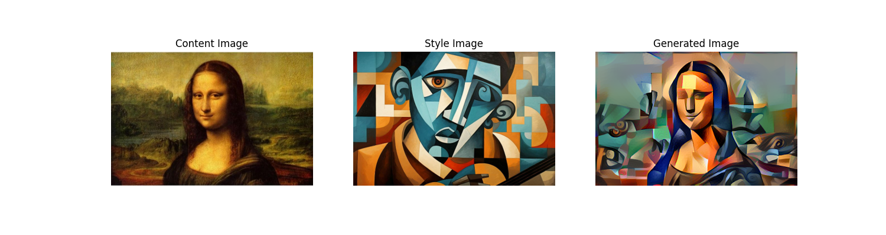
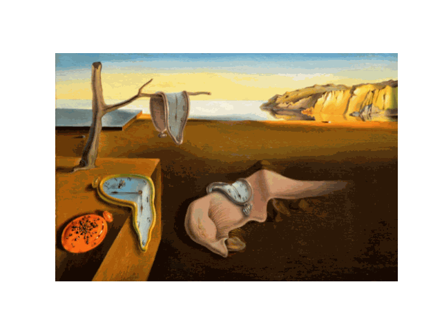
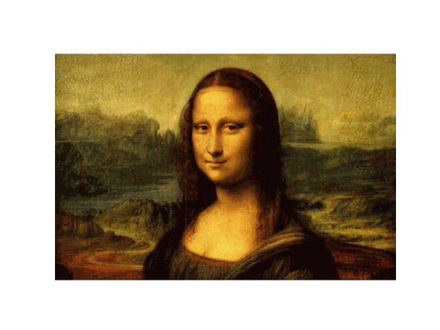
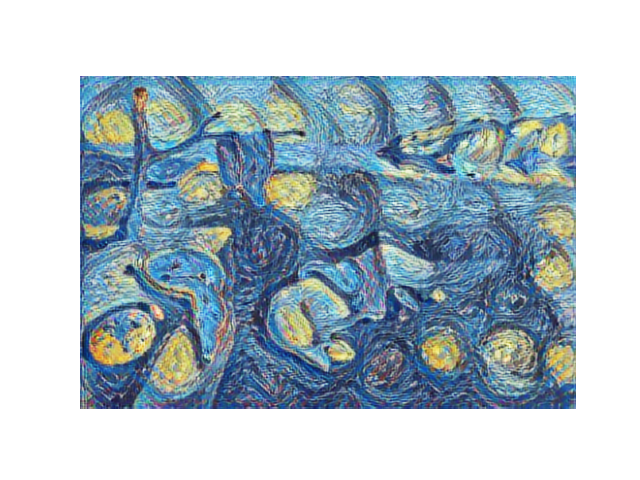
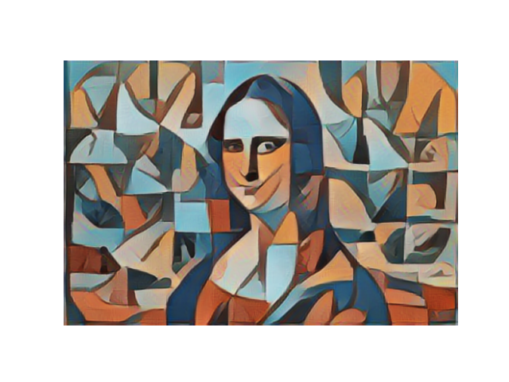

# <h1 align="center">**Neural Style Transfer**</h1>

This repository implements models for [neural style transfer](https://arxiv.org/abs/1508.06576), an optimization technique used to blend two images: a content image and a style reference image (e.g., artwork). The goal is to generate an output image that preserves the content of the former while adopting the visual style of the latter. This implementation optimizes the output image to match the content and style statistics of the input images, extracted through a convolutional neural network, using pre-trained models such as [VGG19 in Tensorflow](https://www.tensorflow.org/api_docs/python/tf/keras/applications/VGG19) and [VGG19 in PyTorch](https://pytorch.org/vision/main/models/generated/torchvision.models.vgg19.html). Additionally, it includes an implementation of Fast Neural Style Transfer in TensorFlow using a pre-trained model from [TensorFlow Hub](https://tfhub.dev/) for arbitrary image stylization.

## **Results**

- **The Persistence of Memory (Salvador Dalí) <-- The Starry Night (Vincent van Gogh)**

 

- **Mona Lisa (Leonardo da Vinci) <-- Cubism (Juan Gris)**

 

- *Results across epochs*

    

        
        
    

- *Results with the TensorFlow Hub model*

    

        
        
    

*You can find more examples in the model notebooks.*

## **Technological Stack**
 

## **Contact**

